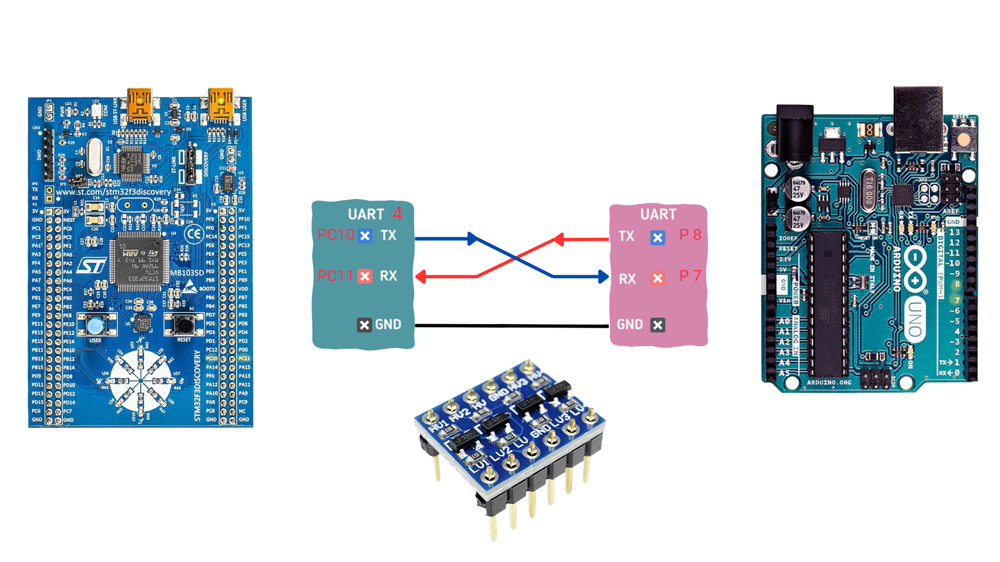
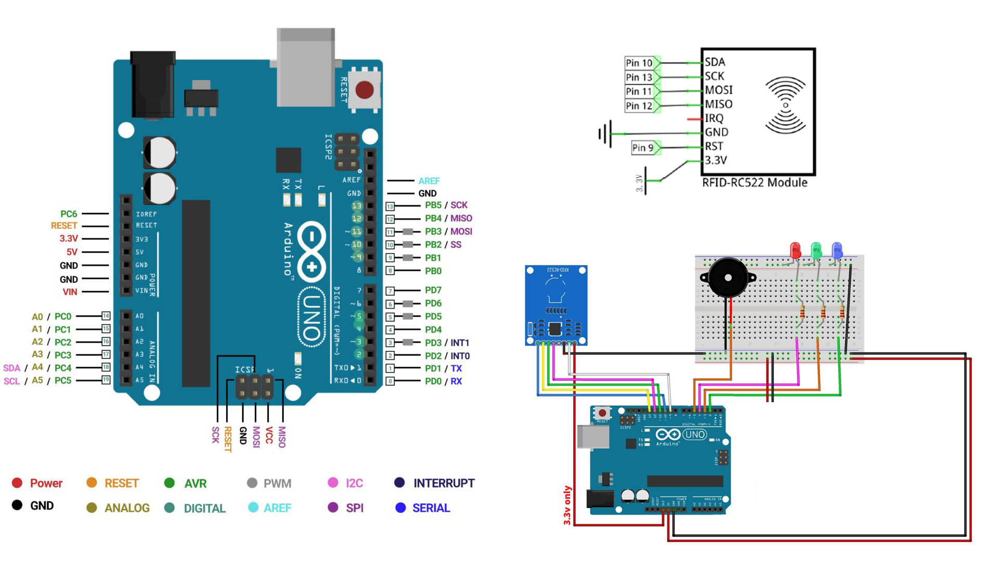
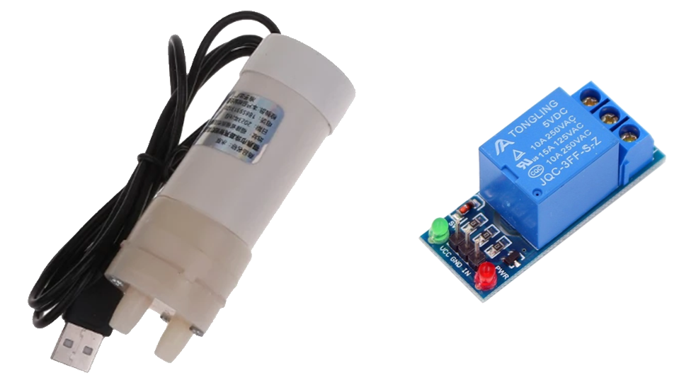
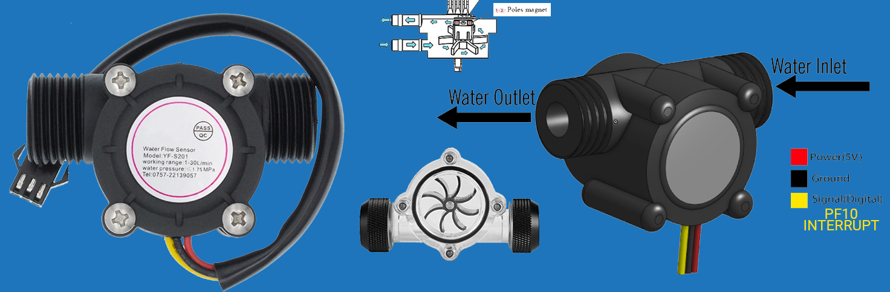
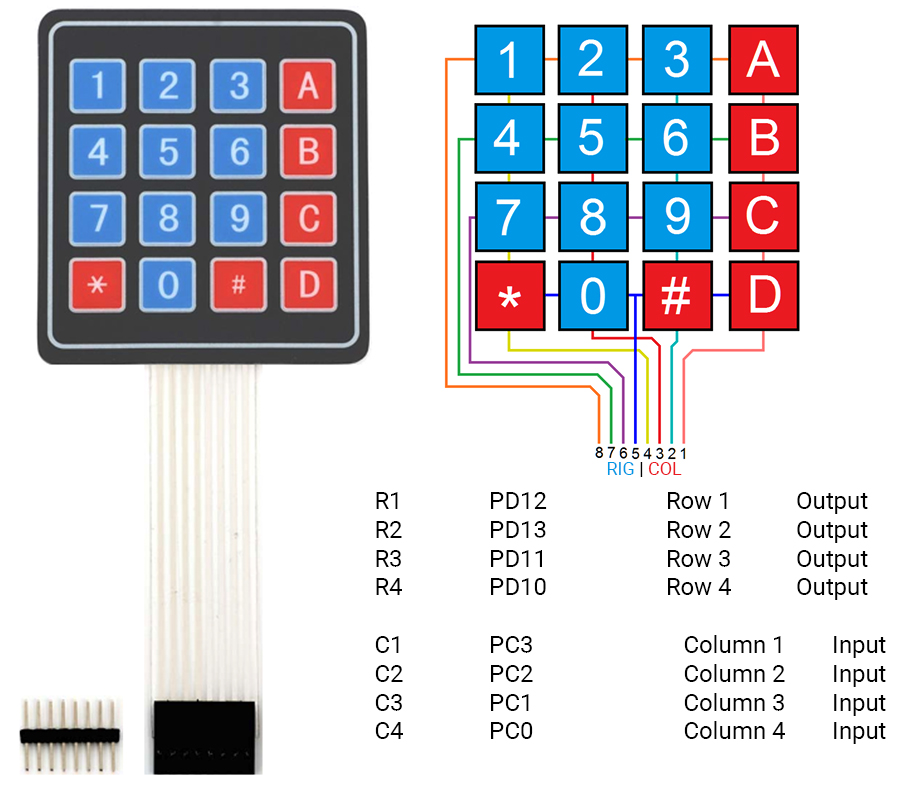
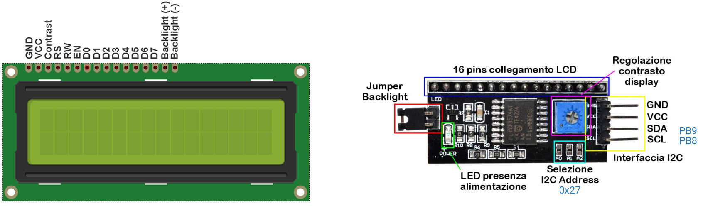
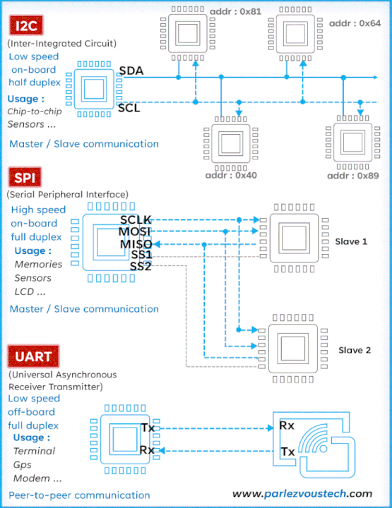

# Erogatore di bibite con autorizzazione RFID con stm32f-arduino 🚰
Progettazione di un erogatore di bevande con autorizzazione RFID. Trasmissione tra stm32f3Discovery e Arduino uno. Progetto per l'esame CSD/APC.

Inserire foto finale...

## Indice
- [Erogatore di bibite con autorizzazione RFID con stm32f-arduino 🚰](#erogatore-di-bibite-con-autorizzazione-rfid-con-stm32f-arduino-)
  - [Indice](#indice)
  - [Introduzione](#introduzione)
  - [STM collegamento Uart ad Arduino](#stm-collegamento-uart-ad-arduino)
  - [Sensore RFID ed autorizzazione](#sensore-rfid-ed-autorizzazione)
  - [Relè ed attivazione pompa](#relè-ed-attivazione-pompa)
  - [Flussimetro](#flussimetro)
  - [Tastierino 4x4](#tastierino-4x4)
  - [Display LCD 16x2](#display-lcd-16x2)
  - [Pulsante Blu attivazione/disattivazione relè](#pulsante-blu-attivazionedisattivazione-relè)
  - [Sintesi protocolli schema](#sintesi-protocolli-schema)
  - [Pinout View STM](#pinout-view-stm)
  - [Software utilizzati](#software-utilizzati)
  - [Licenza](#licenza)


## Introduzione
Il lavoro consiste nella progettazione e realizzazione di un **erogatore di bevande**.  
Per tale scopo sono stati utilizzati diversi dispositivi per testare le svariate tipologie di comunicazione affrontate durante il corso.

Come primo obiettivo del progetto abbiamo deciso di realizzare una comunicazione tra un **Arduino Uno** ed una scheda della **ST Microelectronics** (STM32F3DISCOVERY).  
La parte dell'autorizzazione all'erogazione è stata implementata in Arduino con un **lettore RFID** (comunicazione SPI).  
Tramite **comunicazione seriale** viene trasmesso l'**ID** della carta autorizzata all'erogazione.  
Tale ID viene mostrato su uno **schermo** con un adattatore $I^2C$ .  
Tramite un **tastierino** viene così inserita la quantità di fluido da erogare espressa in millilitri.  
Viene quindi attivata la **pompa** tramite un **relè** e quando il **flussimetro** rileva la quantità corretta viene interrotto il flusso spegnendo la **pompa**.

## STM collegamento Uart ad Arduino


Per la comunicazione tra la scheda ST e Arduino, è stata scelta una **comunicazione asincrona tramite UART**. Sulla STM32F3Discovery, è stata utilizzata la **UART4** con i pin PC10 come TX e PC11 come RX. Sulla scheda Arduino, tramite la libreria "SoftwareSerial", sono stati scelti i pin 7 per TX e 8 per RX. La ricezione della scheda è stata impostata tramite **interrupt** (EXTI line 34)  con velocità di trasferimento a **9600 Bits/s** (Per interfacciarsi con Arduino) con 8 Bit senza parità e con bit di stop.

Dopo vari test e ricerche, si è constatato che i pin della scheda ST utilizzano un livello logico a 3.3V, mentre quelli di Arduino utilizzano 5V. Pertanto, è stato aggiunto al circuito un **convertitore di livello logico bidirezionale** per adattare correttamente i segnali tra i pin, come mostrato in figura.

## Sensore RFID ed autorizzazione


Per utilizzare il **sensore RFID**, è stata necessaria la **comunicazione SPI**, come mostrato nei collegamenti in figura. Per le principali funzionalità del sensore è stata utilizzata la libreria **MFRC522**. Se il tag RFID non è presente nella lista, si accenderà il **LED rosso** e il **buzzer** emetterà un suono di errore. Quando la scheda viene riconosciuta, l'ID letto viene comunicato alla scheda ST, il **LED verde** si accenderà e il **buzzer** emetterà un suono di conferma dell'accesso corretto.

## Relè ed attivazione pompa


Per l'accensione e lo spegnimento della pompa è stato utilizzato un **relè da 5V**, comandato tramite il pin PA8 della scheda STM. Il segnale è stato convertito da 3.3V a 5V utilizzando un convertitore di livello logico, come fatto per la comunicazione UART tra le due schede.

La **pompa** viene attivata una volta inserito il quantitativo di fluido da erogare e si spegne quando il **flussimetro** rileva che il quantitativo corretto è stato erogato.

Dalle specifiche tecniche della pompa idraulica, il **consumo energetico** può arrivare fino a **2A**. Per questo motivo, la pompa è stata alimentata con un **alimentatore esterno**, con il cavo positivo interrotto dal relè.

## Flussimetro


Per calcolare il **quantitativo erogat**o è stato utilizzato il  **flussimetro YF-S201** . 
Questo dispositivo è costituito da un corpo in plastica con un piccolo rotore interno che gira quando l'acqua passa attraverso il sensore. Il **movimento del rotore**, dotato di alette e di un piccolo **magnete**, genera **impulsi elettrici** che possono essere letti da un microcontrollore.

Quando l'acqua fluisce attraverso il sensore, essa fa girare il rotore interno. Il sensore **Hall** presente nel flussimetro rileva il passaggio del magnete sulle alette del rotore e genera impulsi elettrici corrispondenti alla velocità del flusso d'acqua. Il numero di impulsi generati è proporzionale alla velocità del flusso, permettendo così di calcolare il volume d'acqua passato attraverso il sensore in un determinato periodo di tempo.

Dal datasheet :
level test pulse  frequency(Hz)=[7.5*Q] ±3% (Level test)(Q is the flow rate L / min)

Il flusso ed il quantitativo erogato sono stati calcolati come di seguito: 
```C
void SysTick_Handler(void)
{
  /* USER CODE BEGIN SysTick_IRQn 0 */
	i++;
	if(i==500){
		freq=pulse;
		Flow=(freq * 1000.0f)/(7.5*60.0f);
		erogato=erogato+Flow;
		i=0;
		pulse=0;
	}
  /* USER CODE END SysTick_IRQn 0 */
  HAL_IncTick();
  /* USER CODE BEGIN SysTick_IRQn 1 */

  /* USER CODE END SysTick_IRQn 1 */
}

void EXTI15_10_IRQHandler(void)
{
  /* USER CODE BEGIN EXTI15_10_IRQn 0 */
	if(HAL_GPIO_ReadPin(GPIOF,GPIO_PIN_10)){
		pulse++;
	}
  /* USER CODE END EXTI15_10_IRQn 0 */
  HAL_GPIO_EXTI_IRQHandler(GPIO_PIN_10);
  /* USER CODE BEGIN EXTI15_10_IRQn 1 */

  /* USER CODE END EXTI15_10_IRQn 1 */
}

```

## Tastierino 4x4


Le **tastiere a matrice** utilizzano una combinazione di quattro righe e quattro colonne per fornire gli stati dei pulsanti al dispositivo host. Sotto ogni tasto c'è un pulsante, con un'estremità collegata a una riga e l'altra estremità collegata a una colonna.

Per determinare quale **pulsante** è stato premuto, il microcontrollore imposta inizialmente tutte le righe a livello alto. Successivamente, una alla volta, ciascuna riga viene impostata a livello basso, e lo stato delle colonne viene controllato. A seconda dello stato delle colonne, il microcontrollore può capire quale pulsante è stato premuto.

Ad esempio, il programma imposta tutte e quattro le righe a livello alto e poi imposta la prima riga a livello basso. Successivamente, legge gli stati di ingresso di ciascuna colonna. Se il pin di una colonna è basso, significa che è stato fatto un contatto tra quella colonna e la riga impostata a livello basso, quindi il pulsante corrispondente è stato premuto.

La pressione dei tasti della 4 colonna è stata ignorata come pure per il tasto '#' a cui non eravamo interessati, mentre **il tasto '*'** è stato utilizzato per tornare indietro nell inserimento e quindi poter sovrascrivere le cifre inserite prima dell'erogazione.

## Display LCD 16x2


Un d**isplay LCD 16x2** è un tipo di schermo a **cristalli liquidi** che può mostrare fino a 16 caratteri su due righe, per un totale di 32 caratteri visibili contemporaneamente. Il display è dotato di retroilluminazione per migliorare la visibilità in condizioni di scarsa illuminazione. Nel progetto è stato utilizzato il driver **HD44780**  che facilita notevolmente la gestione del display.

L'utilizzo di un **adattatore I2C** con un display LCD offre molti vantaggi. Invece di collegare numerosi pin del microcontrollore direttamente all'LCD, un adattatore I2C permette di usare solo due pin: **SDA (dati) e SCL (clock)**. Questo è particolarmente utile quando si dispone di poche linee GPIO. L'adattatore I2C funziona tramite un protocollo di comunicazione seriale che utilizza due fili. **SDA** trasporta i dati tra il microcontrollore e i dispositivi collegati, mentre **SCL** fornisce il segnale di clock che sincronizza il trasferimento dei dati. Ogni dispositivo I2C ha un **indirizzo unico** che il microcontrollore utilizza per inviare comandi e dati al dispositivo corretto.

Nel caso del display LCD, il microcontrollore invia comandi e dati all'adattatore I2C, che li converte in segnali compatibili con l'interfaccia dell'LCD. Questo include comandi per posizionare il cursore o per scrivere caratteri specifici. Utilizzare un adattatore I2C riduce notevolmente il cablaggio necessario e semplifica il design del circuito, permettendo una gestione più efficiente del progetto.

##  Pulsante Blu attivazione/disattivazione relè
Per questioni di sicurezza e per testare meglio il processo è stato introdotto l'uso del pulsante user sulla scheda STM collegato al pin PA0. Tramite **interruzione** **EXTI0** alla pressione del pulsante viene cambiato lo stato del relè e quindi se la pompa stava erogando viene sospesa l'erogazione e viceversa se era spenta verrà attivata la pompa.

##  Sintesi protocolli schema



##  Pinout View STM


## Software utilizzati


Il sistema 1 (STM) è stato sviluppato tramite il software STM32CubeIDE.

Il sistema 2 (Arduino) è stato sviluppato tramite l'ide di Arduino.


## Licenza
Informazioni sulla licenza del progetto.


